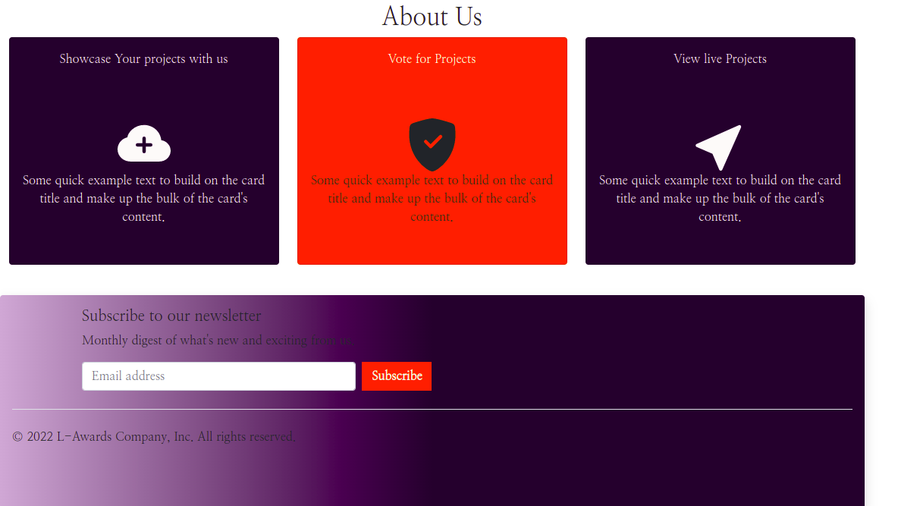
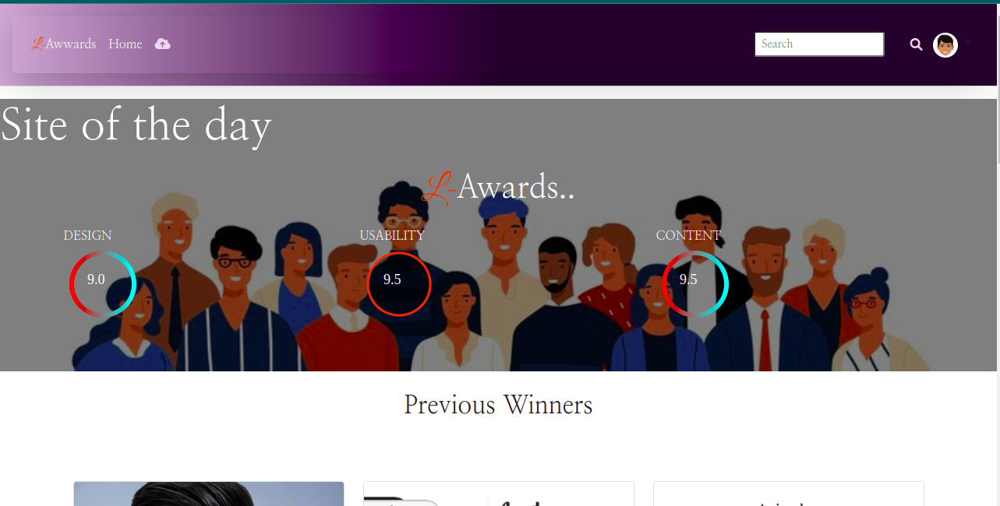
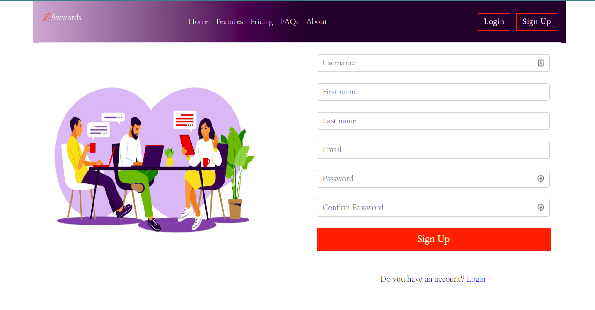

## L-Awards

## Author

  - **Elizabeth Adhiambo** - *Full Stack Developer* -
    

## Project Description

This is a clone of the popular awwwards app  built using Python - Django.

- Users  can view listed projects.
- Users can login to rate on posted projects.
- Users can interact with the Api used to build the project through Django Rest Framework.
- Users login to the platform and post projects to be rated.

 

## Behaviour Driven Development
BDD focuses on how the user will interact with the application. What users will see and experience:

1.Landing page with the Information about the page in the about section. 
2. Users can login if they already have an acount or alternatively sign up. 
3.After loging in users will be redirected to the home page where they can view different projects.A user can hover on the image and click on the view project button to be directed to the individual project page. 
4.Users can rate the project and also see what other users have rated the project. 
5. After clicking the rate button User will be directed to the ratig page where they'll see a wider view of the project, scroll to the rate form and rate the project based on design, userbility and content out of ten. 
4.Users can also  access a project's live link or the github repository. 
5.Click on the upload project svg to add a project for others to view or the avatar icon to add a new project. 

## Getting Started

To clone the repository, run:

    git clone https://github.com/Liz2222/awwards.git

Then navigating to the cloned directory:

    cd awards

### Prerequisite
This awwwards Clone project requires a prerequisite understanding of the following:
- Django Framework
- Python3.8
- Postgres
- Python virtualenv

## Setup and installation

###  Activate virtual environment
Activate virtual environment using python3.8 as default handler
    `virtualenv -p /usr/bin/python3.8 award-venv && source award-venv/bin/activate`
####  Install dependancies
Install dependancies that will create an environment for the app to run `pip3 install -r requirements.txt`
####  Create the Database
    - psql
    - CREATE DATABASE awards;
####  .env file
Create .env file and paste paste the following filling where appropriate:

    SECRET_KEY = '<Secret_key>'
    DBNAME = 'awards'
    USER = '<Username>'
    PASSWORD = '<password>'
    DEBUG = True
#### Run initial Migration
    python3.8 manage.py makemigrations 
    python3.8 manage.py migrate
#### Run the app
    python3.8 manage.py runserver
    Open terminal on localhost:8000

## Deployment

The application is deployed on Heroku and is live on this link:

[https://awards-liz.herokuapp.com/](https://awards-liz.herokuapp.com/)

## Built With

  - [Django Rest Framework](https://www.django-rest-framework.org/) - Develop the API for communicating with the backend.
  - [Django 4.0.5](https://docs.djangoproject.com/en/4.0/releases/4.0.4/) - Back end logic of the application.
  - [Bootstrap](https://getbootstrap.com/) - Used for overall design and responsive site
  

## Contributing

Please read [CONTRIBUTING.md](CONTRIBUTING.md) for details on our code
of conduct, and the process for submitting pull requests to us.

## License

MIT License

Copyright (c) 2022 Elizabeth Adhiambo

Permission is hereby granted, free of charge, to any person obtaining a copy
of this software and associated documentation files (the "Software"), to deal
in the Software without restriction, including without limitation the rights
to use, copy, modify, merge, publish, distribute, sublicense, and/or sell
copies of the Software, and to permit persons to whom the Software is
furnished to do so, subject to the following conditions:

The above copyright notice and this permission notice shall be included in all
copies or substantial portions of the Software.

THE SOFTWARE IS PROVIDED "AS IS", WITHOUT WARRANTY OF ANY KIND, EXPRESS OR
IMPLIED, INCLUDING BUT NOT LIMITED TO THE WARRANTIES OF MERCHANTABILITY,
FITNESS FOR A PARTICULAR PURPOSE AND NONINFRINGEMENT. IN NO EVENT SHALL THE
AUTHORS OR COPYRIGHT HOLDERS BE LIABLE FOR ANY CLAIM, DAMAGES OR OTHER
LIABILITY, WHETHER IN AN ACTION OF CONTRACT, TORT OR OTHERWISE, ARISING FROM,
OUT OF OR IN CONNECTION WITH THE SOFTWARE OR THE USE OR OTHER DEALINGS IN THE
SOFTWARE.

